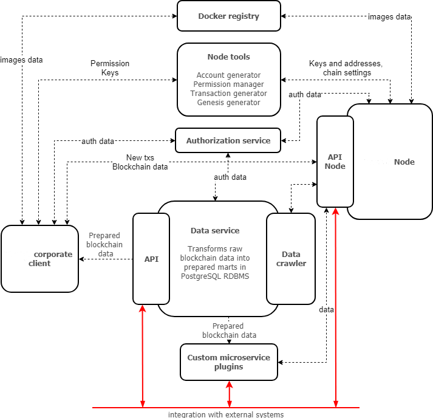

Архитектура
========================================

Платформа Vostok построена на базе технологии распределенного реестра. Это позволяет добиться согласованности и доступности данных, а также устойчивости 
к злонамеренному изменению информации.
Vostok использует язык программирования Scala и имеет модульную архитектуру, что позволяет гибко подстраивать приложение под потребности бизнеса.

Наша платформа поддерживает алгоритмы консенсуса Proof-of-Stake и Proof-of-Authority, подробнее в разделе :ref:`Консенсус <consensus>`. 
Также в Vostok реализован механизм анкоринга сетей, подробнее в разделе :ref:`Анкоринг <anchoring>`.

Анкоринг позволяет создать конфигурацию сети, использующую сильные стороны обоих алгоритмов консенсуса.
Например, основной блокчейн Vostok базируется на алгоритме консенсуса Proof-of-Stake, так как поддерживается независимыми участниками.
В тоже время корпоративные сайдчейны, в которых нет необходимости стимуляции майнеров за счёт комиссий за транзакции, могут использовать алгоритм Proof-of-Authority.
Сайдчейны встраиваются в основной блокчейн с помощью механизма анкоринга (помещая криптографические доказательства транзакций в основную блокчейн-сеть).

Топология сети, включающая основную цепочку и сайдчейны, представлена на схеме 
 
 .. image:: img/architecture-sidechains.png

**Архитектура ноды**
 
 .. image:: img/architecture-node-1.png

- Node API – интерфейс REST API ноды, позволяющий получать данные из блокчейна, подписывать и отправлять транзакции;
- Node storage – компонент системы, обеспечивающий хранение полного журнала транзакций и состояния блокчейна;
- Unconfirmed transaction pool – компонент, обеспечивающий хранение неподтвержденных транзакций до момента их проверки и отправки в блокчейн;
- Consensus and cryptolibraries – компоненты, отвечающие за механизм достижения согласия между узлами, а также за криптографические алгоритмы;
- KeyStore - хранилище приватных ключей, которое используется нодой для валидации, подписания и шифрования транзакций;
- Miner – компонент, отвечающий за формирование блоков транзакций для записи в блокчейн;
- Network layer – слой логики, обеспечивающий сетевой протокол взаимодействия нод;
- Smart-contract environment – среда для выполнения Тьюринг-полных смарт-контрактов;
- Validation logic – слой логики, содержащий правила проверки транзакций;
- Config – конфигурационные параметры ноды;
- Monitoring Service – сервис мониторинга, включающий базу для хранения временных рядов с данными и метриками приложения.

**Дополнительные сервисы**

 
- Vostok corporate client – корпоративный клиент для управления сетью и взаимодействия с блокчейном. Подробнее в разделе :ref:`Общее описание клиента <client>`
- Data service – сервис, агрегирующий данные из блокчейна и предоставляющий возможность построения различных аналитик посредством SQL запросов;
- Node tools – набор утилит, автоматизирующих процессы управления ключами в keystore ноды, генерации транзакций и подписания genesis-блока;
- Authorization service – единый сервис авторизации для компонентов системы;
- Docker registry – сервис для хранения и управления образами Тьюринг-полных смарт-контрактов.