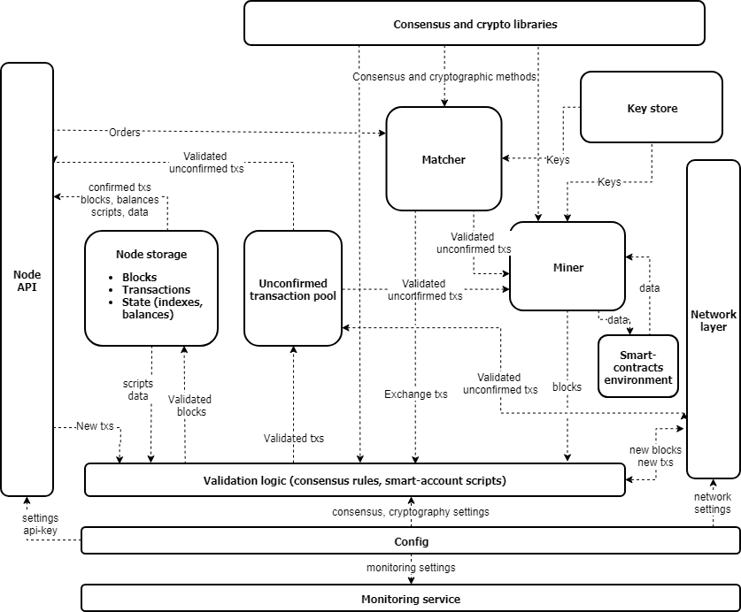
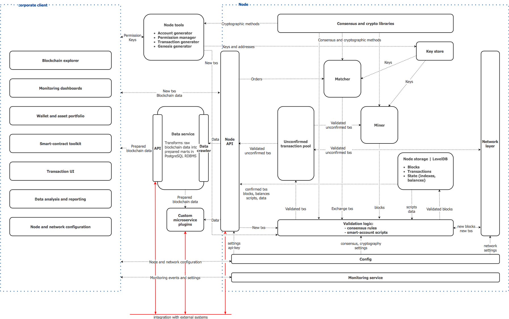
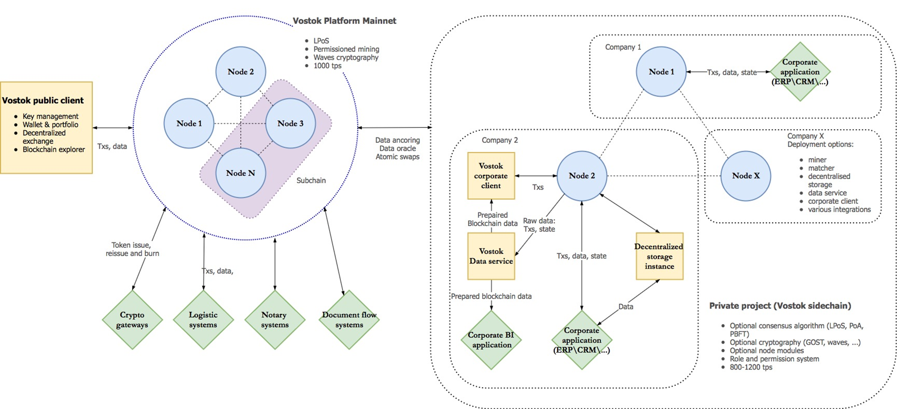

Архитектура платформы
========================================

(нужно перевести и переработать текст)

.. image:: img/architecture-client-1.png

Vostok platform provides out-of-the-box solution for launching a custom permissioned chain for the given business case. The focus is made on flexibility of the custom chain, its customization features.  Therefore it is of a vital importance to provide a module architecture that  supports different consensus algorithms, cryptography schemes, and role models.

Figure below describes general Vostok Node architecture.

Different architectures may require different approach to the blockchain consensus.  In the main chain we use PoS algorithm, which supports the economical model based on VST token holdings, making profits from network maintenance proportional to a stake in VST token held by a node. On the other hand, for corporate sidechains it may make more sense to provide consensus algorithm that does not require introduction of any new entities and is more focused on required technical parameters of the network such as throughput.  To this end we implement the following consensus algorithms, in addition to PoS: Proof of Authority and PBFT. In a permissioned blockchain they basically serve the same purpose of providing basic and simple consensus for a system with a small to moderate amount of nodes, focusing on speed.  The goal of consensus protocols in permissioned systems is to provide the validators succession, and provide for the distributed nature of the system. Sybil attacks that undermine the security of open blockchains are impossible in this case, since all the validating nodes are vetted by a centralized administrator. Thus the focus in the consensus algorithms in permissioned blockchains is not on the scarce resource that has to be used in order to be eligible for the mining reward, but  on the system decentralization and fairness.

Main idea: basically we have a fractal network, where side- and sub-chains replicate the main chain, and the main chain is used as a global arbiter and reference chain, sidechains are meant to be customizable and potentially interacting with the main chain

Vostok blockchain is meant to be a universal solution for fast deployment of customizable blockchain applications for enterprise and public services usage. Network architecture and topology is constructed to be highly customizable, at the same time accounting for the benefits of open blockchain economic models.  It is understood that certain businesses and applications would need a separate permissioned chain, maintained and supported by a certain group of nodes, rather than by all the nodes of the permissioned chain. At the same time, these chains can be secured by a larger, “master” chain through mechanism similar to merged mining.

Thus we obtain the following topology of the system: The main chain is supported by a selected group of nodes, side chains are similar in design to the main chain, at the same time having an architecture tailor-made to account for the concrete business case. Side chains tie in into the main chain through checkpointing (placing cryptographic proofs of transactions in side chains onto the main chain) or merged mining process, in which main net nodes secure the side chain data without actually storing it.

Mainnet is optimized for performance and data storage; since the network is permissioned the technical specification for the supporting nodes can account for the required network throughput and data storage capacity.  Its main purpose is to support high throughput and serve as an anchor for corporate sidechains which are attuned to specific needs of corresponding businesses.  Of course, mainchain can be used for maintaining business applications that do not require a separate network, for example payments, notarized data storage, loyalty programs etc.

On the other hand, sidechains can be launched and maintained according to the concrete business case.  Imitating the main-chain architecture in general, they might be quite divergent from it in applications and usage. Thus Vostok chain supports different consensus algorithms, different cryptography schemes and role models. Cryptography and consensus is realized in module architecture, which allows for quick launch of private sidechains  with required properties.

Figure below describes overall Vostok Platform architecture, as well as sidechain and mainnet relations and communications.

