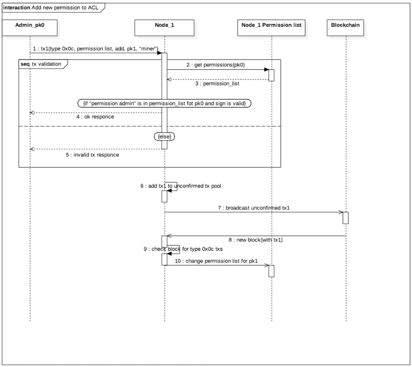

.. _authorization:

Авторизация участников
========================================
В блокчейн-платформе реализован механизм ограничения действий участников на основании ролевой модели.

Механизм разрешений позволяет владельцу платформы обезопасить участников от угроз:

- атак недобросовестных майнеров на блокчейн-сеть;
- несанкционированного выпуска токенов;
- несанкционированной биржевой деятельности;
- несанкционированного доступа к конфиденциальной информации;
- иных противоправных действий злоумышленников.

Порядок выдачи и отзыва разрешений приведен в разделе :ref:`role-management`.

Ролевая модель
--------------------------

В таблице ниже представлен список возможных ролей платформы:

====================          ==============================================================================
Название роли                 Полномочия
====================          ==============================================================================
permissioner                  Формирование транзакций для изменения списка разрешений
blacklister                   Формирование транзакций для изменения black list
miner                         Создание новых блоков
issuer                        Формирование транзакций по выпуску, перевыпуску и сжиганию токенов
dex                           Формирование exchange транзакции (deprecated)
contract_developer            Формирование транзакций на создание docker-контракта 
connection-manager            Формирование транзакций на регистрацию/удаление ноды в блокчейн сети
banned                        | Запрещено отправлять какие-либо транзакции в блокчейн.
                              | Группа всех участников с данной ролью образует blacklist
====================          ==============================================================================

Модель разрешений
-------------------

Модель разрешений описывает механизм применения различных типов разрешений при валидации операций в блокчейн-сети.

===========================================     ==============================================
Действие                                        Условие разрешения действия
===========================================     ==============================================
Назначение или удаление роли                    Наличие роли permissioner
Добавление или удаление из blacklist            Наличие роли permissioner или blacklister
Регистрация нового узла сети                    Наличие роли connection-manager
Формирование и выпуск блоков                    Наличие роли miner
Операции с токенами (issue, reissue, burn)      Наличие роли permissioner или issuer
Биржевые операции (exchange)                    Наличие роли permissioner или dex
Перевод токенов (transfer, masstransfer)        Отсуствие пользователя в blacklist
Лизинг токенов (lease, lease cancel)            Отсуствие пользователя в blacklist
Создание псевдонима (alias)                     Отсуствие пользователя в blacklist
Создание docker-контракта                       Наличие роли contract_developer
Исполнение docker-контракта                     Отсуствие пользователя в blacklist
===========================================     ==============================================

Обновление списка разрешений
----------------------------------------

Для изменения списка разрешений используется permission-транзакция.

Поля транзакции:

- Transaction Type
- Version
- Sender PublicKey
- Target Address or Alias
- Timestamp
- Operation Byte
- Role Byte
- Timestamp
- Due Timestamp Defined Byte (0 - None, 1 - Defined)
- Due Timestamp Bytes

Последовательность действий при обновлении списка разрешений приведена на схеме ниже.

При изменении списка разрешений платформа выполняет следующие проверки:

1. Отправитель не находится в blacklist;
2. У отправителя есть роль permissioner;
3. DueTimestamp (время действия роли) > Timestamp (текущее время);
4. Такая роль не активна (в случае добавления), либо активна (в случае удаления).
