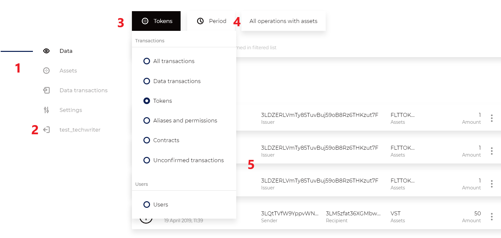

Раздел «Данные»
========================================

Раздел содержит информацию о транзакциях в блокчейне. Для получения информации используйте переключатели и поисковую строку с указанием полей транзакций для поиска.
**Транзакции со смарт-контрактами появятся в релизе 0.8**

Описание элементов интерфейса:

#. Навигация между разделами
#. Выход из клиента
#. Переключатель отображаемых групп транзакций
#. Фильтры, контекстные выбранной группе транзакций
#. Список транзакций

Список транзакций
----------------------------
Отображает краткую информацию о транзакциях, отсортированную от свежих к старым. Переключатели и поиск определяют содержание списка. 

Переключатель между группами транзакций и пользователями
~~~~~~~~~~~~~~~~~~~~~~~~~~~~~~~~~~~~~~~~~~~~~~~~~~~~~~~~~

Переключатель формирует список транзакцияй выбранной группы или список пользователей:

* Транзакции с данными
* Транзакции с токенами
* Транзакции с разрешениями и псевдонимами пользователей
* Неподтверждённые транзакции
* Информация о пользователях

.. important:: Пользователем в Vostok считается адрес с псевдонимом. Псевдоним присваивается при регистрации через интерфейс. Адреса, созданные другим способом, рассматриваются как служебные.

Поиск
~~~~~~~~
Поиск производится в выбранных полях транзакций вхождения символов, введеных в поисковую строку. Для поиска по конкретной группе транзакций укажите её при помощи переключателя.

.. image:: img/search.png

**Описание полей транзакций, в которых идёт поиск**

* "Искать в сообщениях и в описаниях токенов" — поиск в сообщениях трансферов и масс-трансферов, а также в описаниях токенов.
* "Искать по номеру блока" — поиск в поле «Высота блока», в котором находится транзакция.
* "Искать в авторах и отправителях транзакций" — поиск в адресах или псевдонимах отправителей транзакций.
* "Искать в получателях транзакций" — поиск в адресах или псевдонимах получателей транзакций.
* "Искать как участника" — поиск в адресах или псевдонимах отправителей и получателей транзакций.
* "Искать в идентификаторах транзакций" — поиск в идентификаторах транзакций.
* "Искать в идентификаторах токена" — поиск в идентификаторах токенов. Идентификатор токена равен идентификатору транзакции выпуска.
* "Искать в подписях" — поиск в подписях транзакций. Подпись транзакции — служебная информация и не отображается в интерфейсе.
* "Искать в транзакциях с данными" — поиск в ключах и значениях транзакций. 
* "Искать везде" — поиск по всем вышеперечисленным полям, будет доступно в релизе 0.8.

.. hint:: При поиске по данным используйте запрос ключ\значение чтобы быстро получить нужную транзакцию.

Для переключателя «Пользователи»

* "Искать по адресу" — поиск в адресах пользователей.
* "Искать в псевдонимах" — поиск в псевдонимах пользователей.

Страница с информацией о транзакциях
--------------------------------------
Содержит вкладки:

* Информация — данные о транзакции.
* Пользователи — информация об участниках транзакции.
* Блок — информация о блоке, в котором находится транзакция, и список транзакций в блоке.

Вкладка «Информация»
~~~~~~~~~~~~~~~~~~~~~~~

.. table:: Описание значения полей на вкладке «Информация» для различных типов транзакций

    +------------------------+--------------------------------------+---------------------+---------------------------+
    | Поле                   | Описание                             | Тип транзакции      | Значение                  |
    +========================+======================================+=====================+===========================+
    | Комиссия               | Размер комиссии, удержанной          | Для всех типов      | Число                     |
    |                        | за транзакцию                        | транзакций          |                           |
    +------------------------+--------------------------------------+---------------------+---------------------------+
    | Дата                   | Дата попадания транзакции            | Для всех типов      | Дата                      |
    |                        | в блокчейн                           | транзакций          |                           |
    +------------------------+--------------------------------------+---------------------+---------------------------+
    | Автор                  | Псевдоним или адрес отправителя      | Данные              | Текст                     |
    |                        |                                      | Разрешения          |                           |
    +------------------------+--------------------------------------+---------------------+---------------------------+
    | Список «Ключ-значение» | Данные, переданные в транзакции      | Данные              | - Число                   |
    |                        |                                      |                     | - Строка                  |
    |                        |                                      |                     | - Булево значение         |
    |                        |                                      |                     | - Байтовый массив         |
    +------------------------+--------------------------------------+---------------------+---------------------------+
    | Отправитель            | Псевдоним или адрес отправителя      | Отправка токенов    | Текст                     |
    |                        |                                      | Массовая отправка   |                           |
    |                        |                                      | Лизинг              |                           |
    +------------------------+--------------------------------------+---------------------+---------------------------+
    | Получатель             | Псевдоним или адрес получателя       | Отправка токенов    | Текст                     |
    |                        |                                      | Лизинг              |                           |
    +------------------------+--------------------------------------+---------------------+---------------------------+
    | Сообщение              | Текстовое сообщение отправителя      | Отправка токенов    | Текст                     |
    |                        |                                      | Массовая отправка   |                           |
    +------------------------+--------------------------------------+---------------------+---------------------------+
    | Получатели             | Псевдонимы или адреса получателей    | Массовая отправка   | Текст                     |
    +------------------------+--------------------------------------+---------------------+---------------------------+  
    | Описание               | Информация о токене от эмитента      | Выпуск токенов      | Текст                     |
    +------------------------+--------------------------------------+---------------------+---------------------------+
    | Тип                    | Определяет дополнительную            | Выпуск токенов      | - Перевыпускаемые         |
    |                        | эмиссию токенов                      | Доп. эмиссия        | - Неперевыпускаемые       |
    +------------------------+--------------------------------------+---------------------+---------------------------+
    | Псевдоним              | Псевдоним, присвоенный пользователю  | Создание псевдонима | Текст                     |
    +------------------------+--------------------------------------+---------------------+---------------------------+
    | Привязан к адресу      | Адрес, ассоциированный с псевдонимом | Создание псевдонима | Текст                     |
    +------------------------+--------------------------------------+---------------------+---------------------------+
    | Участник               | Адрес или псевдоним пользователя,    | Разрешения          | Текст                     |
    |                        | чьи разрешения изменила транзакция   |                     |                           |
    +------------------------+--------------------------------------+---------------------+---------------------------+
    | Доступ                 | Названия разрешений, которые         | Разрешения          | - Майнинг                 |
    |                        | изменила транзакция                  |                     | - Управление токенами     |
    |                        |                                      |                     | - Управление разрешениями |
    |                        |                                      |                     | - Управление блокировками |
    |                        |                                      |                     | - Заблокированные         |
    +------------------------+--------------------------------------+---------------------+---------------------------+
    | Статус                 | Действие, произведенное              | Разрешения          | - Присвоено               |
    |                        | с разрешениями                       |                     | - Отозвано                |
    +------------------------+--------------------------------------+---------------------+---------------------------+

Вкладка «Пользователи»
~~~~~~~~~~~~~~~~~~~~~~~

.. table:: Описание полей на вкладке «Пользователи» для различных типов транзакций

    +------------------------+---------------------------------+--------------------+--------------------+
    | Поле                   | Описание                        | Тип транзакции     | Значение           |
    +========================+=================================+====================+====================+
    | Роль                   | Роль в транзакции               | Данные             | - Автор            |
    |                        |                                 |                    | - Получатель       |
    |                        |                                 +--------------------+--------------------+ 
    |                        |                                 | Отправка токенов   | - Отправитель      |  
    |                        |                                 | Лизинг             | - Получатель (-и)  |
    |                        |                                 +--------------------+--------------------+ 
    |                        |                                 | Выпуск токенов     | - Эмитент          |
    |                        |                                 | Доп. эмиссия       |                    |
    |                        |                                 +--------------------+--------------------+ 
    |                        |                                 | Вывод из обращения | - Инициатор        | 
    |                        |                                 +--------------------+--------------------+ 
    |                        |                                 | Разрешения         | - Автор            |  
    |                        |                                 |                    | - Участник         |
    |                        |                                 +--------------------+--------------------+ 
    |                        |                                 | Псевдоним          | - Автор            | 
    +------------------------+---------------------------------+--------------------+--------------------+
    | Псевдонимы             | Псевдонимы участников           | Для всех типов     | Псевдонимы         |
    |                        | транзакции                      | транзакций         |                    |
    +------------------------+---------------------------------+--------------------+--------------------+
    | Адрес                  | Адреса участников транзакции    | Данные             | Адрес              |
    +------------------------+---------------------------------+--------------------+--------------------+
    | Баланс                 | Балансы участников транзакции   | Данные             | Число              |
    |                        | на текуший момент               |                    |                    |
    +------------------------+---------------------------------+--------------------+--------------------+
    | Разрешения             | Разрешения участников транзакции| Для всех типов     | Названия           |
    |                        | на текуший момент               | транзакций         | разрешений         |
    +------------------------+---------------------------------+--------------------+--------------------+

Вкладка «Блок»
~~~~~~~~~~~~~~~~~~~~~~~

Идентична для всех типов транзакций

.. csv-table:: Описание полей на вкладке "Блок" для всех типов транзакций
   :header: "Параметр","Описание","Значения"
   :widths: 25, 50, 25

   Высота блока,Высота блокчейна на которой блок добавлен в цепь,Число
   Версия,Тип блока,1 для генезис 3 для остальных
   Дата формирования,Дата формирования блока,Дата
   Предыдущий блок,Ссылка на блок,id Блока
   Подпись блока,Подпись блока,Подпись
   Сложность,Служебный параметр,Ссылка на POS
   Размер,Вес блока в байтах,Число
   Создан,Адрес майнера,Адрес в сети
   

