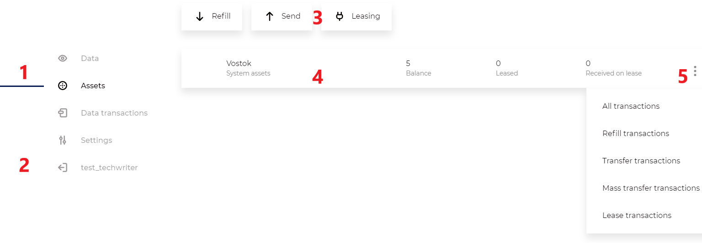

Раздел «Токены»
========================================

Отображает баланс авторизованной учетной записи. Позволяет переводить токены другим участникам сети, передавать токены в аренду и управлять токенами.
Управление токенами требует разрешения «Управление токенами».

Описание элементов интерфейса:

#. Навигация между разделами
#. Выход из клиента
#. Элементы управления
#. Список токенов
#. Быстрые действия

Портфель
----------------------------

Элементы управления  
~~~~~~~~~~~~~~~~~~~~~

* Пополнение — доступно только в partner-net, пополняет баланс на 50 VST при балансе менее 50 VST, для задач тестирования блокчейна.
* Переводы  — перевод токенов одному или нескольким участникам.
    * Перевод 
    * Массовый перевод — комиссия при переводе трем и более получателям меньше, чем суммарная комиссия при соответствующем количестве единичных переводов.
* Аренда — актуально для сетей на PoS консенсусе.
    * Передать в аренду — передача части своего баланса в аренду майнеру. Майнинг возможен при наличии на балансе адреса более 1000 VST и разрешения на майнинг.
    * Прекратить аренду — возврат средств, переданных в аренду, на ваш баланс, доступный для транзакций.
* Управление
    * Выпуск токенов — выпуск своего набора токенов. Параметры: количество, минимальная доля, возможность дополнительной эмиссии, SmartAsset.
    * Дополнительная эмиссия — увеличение количества токенов в обороте. Доступно только эмитенту, если было разрешено при первоначальном выпуске.
    * Вывод из обращения — безвозвратное уничтожение токенов. Уничтожить можно только токены на вашем балансе.

Список токенов
~~~~~~~~~~~~~~~~~~~~~~~~~~~~~~~~~~~

Отображает информацию по токенам:

* Названия
* Логотип
* Количество на балансе
* Количество токенов в лизинге (только для системного токена)
* Тип токена (системный или пользовательский)
* Быстрые действия (для каждого набора токенов):
    * Транзакции пополнения — отображает входящие транзакции.
    * Транзакции перевода  — отображает исходящие переводы.
    * Транзакции массового перевода — отображает исходящие массовые переводы.
    
Форма перевода токенов
----------------------------

* Выбор токенов для перевода — для смены токена, нажмите на его название.
* Баланс — отображает доступное для перевода количество выбранного токена.
* Адрес получателя — введите адрес или псевдоним получателя.
* Количество — введите, сколько токенов вы хотите перевести, можно переводить целые и дробные числа.
* Сообщение — сообщение для получателя, можети быть просмотрено любым участником сети.
* Комиссия за транзакцию — фиксированная.

Проверка транзакции перед отправкой
~~~~~~~~~~~~~~~~~~~~~~~~~~~~~~~~~~~
Отображает результат заполнения полей формы на предыдущем шаге, с возможностью вернуться назад и исправить.

Подтверждение отправки транзакции 
~~~~~~~~~~~~~~~~~~~~~~~~~~~~~~~~~~~
Отображает результат отправки транзакции. На данном шаге отменить транзакцию невозможно.

Форма массового перевода токенов
---------------------------------

* Выбор токенов для перевода — для смены токена, нажмите на его название.
* Баланс — отображает доступное для перевода количество выбранного токена.
* Адрес получателя, сумма — поле ввода получателей и сумм, через запятую. Каждый получатель с новой строки, доступен импорт списка.
* Сообщение — сообщение для получателей, может быть просмотрено любым участником сети.
* Комиссия за транзакцию — рассчитывается автоматически, зависит от количества получателей.

Проверка транзакции перед отправкой
~~~~~~~~~~~~~~~~~~~~~~~~~~~~~~~~~~~
Отображает результат заполнения полей формы на предыдущем шаге, с возможностью вернуться назад и исправить.

Подтверждение отправки транзакции 
~~~~~~~~~~~~~~~~~~~~~~~~~~~~~~~~~~~
Отображает результат отправки транзакции. На данном шаге отменить транзакцию невозможно

Форма передачи токенов в аренду
---------------------------------

В аренду можно передать только системные токены.

* Баланс — отображает баланс системного токена, доступный для передачи в аренду.
* Адрес получателя — адрес или псевдоним получателя.
* Количество — количество токенов для передачи, можно переводить целые и дробные числа.
* Комиссия за транзакцию — фиксированная.

Проверка транзакции перед отправкой
~~~~~~~~~~~~~~~~~~~~~~~~~~~~~~~~~~~
Отображает результат заполнения полей формы на предыдущем шаге, с возможностью вернуться назад и исправить.

Подтверждение отправки транзакции 
~~~~~~~~~~~~~~~~~~~~~~~~~~~~~~~~~~~
Отображает результат отправки транзакции. На данном шаге отменить транзакцию невозможно.

Форма прекращения аренды токенов
-----------------------------------
Отображает список транзакций аренды, с возможностью выбора одной или нескольких для отмены.

Форма выпуска токенов
-----------------------------------

Выпуск токенов доступен только при наличии разрешения «Управление токенами».

* Название — название вашего токена, которое увидят все пользователи сети. После выпуска токенов изменить невозможно.
* Описание — информация о токене, которую увидят все пользователи сети. После выпуска токенов изменить невозможно.
* Количество выпускаемых токенов — количество выпускаемых целых токенов.
* Дополнительная эмиссия — может быть разрешена или запрещена, определяет возможность довыпуска токенов. После первоначального выпуска можно отменить разрешение на эмиссию.  Если изначально эмиссия была запрещена, разрешить её невозможно.
* Количество знаков после запятой — определяет, операции с какой минимальной частью токена будут доступны в сети. Нельзя изменить после выпуска.
* Комиссия за транзакцию — фиксированная.

Форма дополнительной эмиссии токенов
-----------------------------------

Дополнительная эмиссия доступна только для автора токена при наличии разрешения «Управление токенами».

* Токены — выбор доступных для дополнительной эмиссии токенов. Отображает токены, где вы — эмитент.
* Текущий баланс — количество выбранного токена у вас на балансе.
* Выпущено токено — количество токенов в обращении.
* Дополнительная эмиссия — можно запретить. Отменить запрет невозможно.
* Количество довыпускаемых токенов — увеличит общее количество токенов в обращении. Токены будут добавлены на ваш баланс.
* Комиссия за транзакцию — фиксированная.

Форма вывода токенов из обращения 
-----------------------------------

Вывод из обращения доступен только для автора токена при наличии разрешения «Управление токенами».

* Токены — выбор доступных для вывода из обращения токенов. Отображает токены, где вы — эмитент.
* Текущий баланс — количество выбранного токена у вас на балансе.
* Выпущено токено — количество токенов в обращении.
* Количество выводимых из обращения токенов — уменьшит общее количество токенов в обращении. Токены будут списаны с вашего баланса.
* Комиссия за транзакцию — фиксированная.
