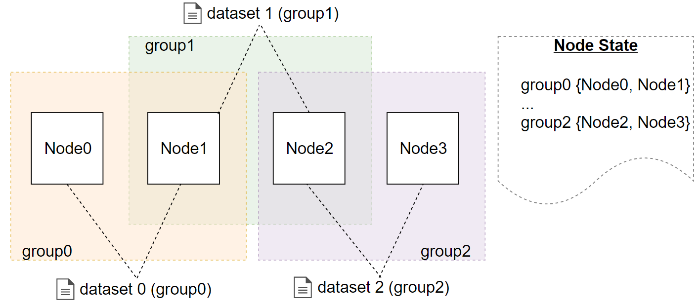

.. _data-privacy:

Конфиденциальность данных
=============================

Блокчейн-платформа Vostok позволяет организовать передачу и хранение конфиденциальных данных между участниками сетевого взаимодействия. Защита конфиденциальных данных при их передаче и хранении обеспечивается набором групп, которые содержат список участников, которые могут обмениваться приватными данными между собой.

Группы доступа
------------------------------

Группа доступа создаётся участниками, которым необходимо обмениваться приватными данными. Группу доступа может создать любой участник сети и включить в неё любой состав других нод сети. Обмениваться информацией внутри группы могут только ноды.

Группа доступа имеет следующие параметры:

* имя (policyName);
* описание (policyDescription);
* срок действия (policyDueDate);
* список получателей конфиденциальных данных (policyRecipients);
* список участников с правами на редактирование состава участников группы (policyOwners).

Создание группы доступа происходит при помощи отправки в блокчейн транзакции :ref:`CreatePolicy <CreatPolicyTransaction>` (type = 112, создание группы).

Владельцы группы имеют право изменять состав участников группы доступа. Для изменения состава участников группы необходимо отправить в блокчейн транзакцию :ref:`UpdatePolicy <UpdatePolicyTransaction>` (type = 113, редактирование группы доступа).

Для внешних приложений в :ref:`API ноды <privacy-api>` реализованы запросы, возвращающие сведения по группе и данным, которые передаются в рамках данной группы: ``GET /privacy/{policy}/recipients``, ``GET /privacy/{policy}/getHashes``, ``GET /privacy/getInfo/{hash}``.

Отправка и получение данных
------------------------------

Отправляемые данные пересылаются посредством ``POST /privacy/sendData`` запросом через собственную ноду организации, в которой проверяется принадлежность отправителя к указанной им группе. Если проверка выполнена успешно, то данные записываются в хранилище ноды, и инициируется транзакция :ref:`PolicyDataHash <PolicyDataHashTransaction>` (type = 114, отправка хеш-суммы данных в сеть) с посчитанной хеш-суммой от передаваемых данных. Передать в сеть данные можно размером не более 20 МБ.

При получении транзакции с хеш-суммой от передаваемых данных принимающая сторона проверяет причастность блокчейн-узла организации к указанной в транзакции группе. Если участник состоит в группе, то выполняется запрос ``getPrivateData`` на получение конфиденциальных данных. Запрос выполняется по сетевому адресу участника группы по установленному P2P соединению. Для обеспечения безопасности при передачи данных по незащищенному каналу связи используется набор алгоритмов шифрования на симметричном ключе и создания сессионных ключей, а также протокол Диффи - Хеллмана.
