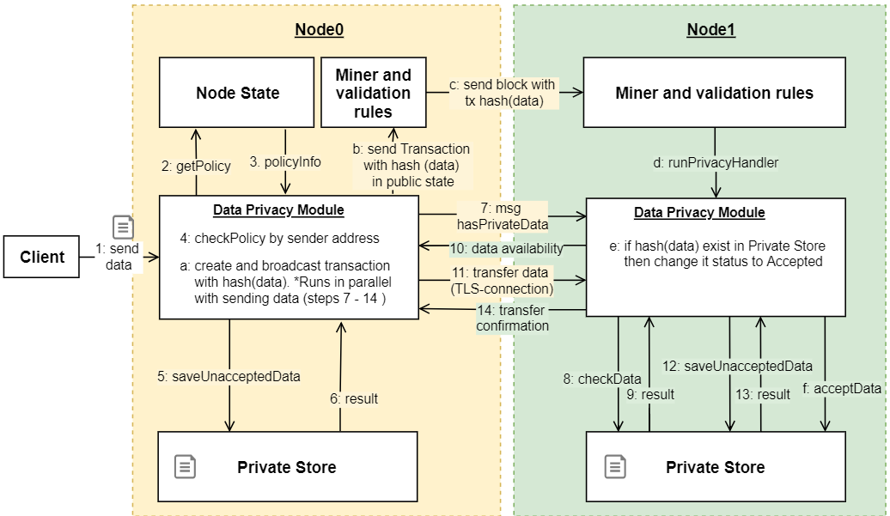

.. _data-privacy:

Конфиденциальность данных
=============================

| Блокчейн-платформа Восток позволяет организовать передачу и хранение конфиденциальных данных между участниками сетевого взаимодействия. 
| Доступ к конфиденциальным данным определяется политиками (policy), которые содержат список сторон, которым разрешается чтение и запись данных.

.. image:: img/policy-1.png
       :align: center

Организация политик обмена
------------------------------

Политика доступа - это сущность регулирующая отношения сторон в рамках взаимодействия с приватными данными. Стороны, которым необходимо обмениваться приватными данными, cоздают политику доступа, согласно которой впоследствии проводят обмен приватными данными. 

Параметры политики:

- описание (policyDescription);
- срок действия (policyDueDate);
- список получателей конфиденциальных данных (policyRecipients);
- список участников с правами на редактирование политики (policyOwners).

Управление политиками доступа осуществляется путем отправки в блокчейн транзакции CreatePolicyTransaction (type = 112).

Для внешних приложений в :ref:`API ноды <privacy-api>` реализовано несколько запросов, возвращающих сведения по политике и данным, которые передаются в рамках данной политике: ``GET /privacy/{policy}/recipients``, ``GET /privacy/{policy}/fullinfo``, ``GET /privacy/{policy}/getHashes``, ``GET /privacy/getInfo/{hash}``.

Обмен конфиденциальными данными
------------------------------------

В упрощенном варианте передача конфиденциальных данных между нодами состоит из следующих этапов:

1. Проверка принадлежности пользователя к policy;
2. Сохранение данных в Private Store ноды с признаком UNACCEPTED;
3. Вычисление хэша от полученных данных;
4. Формирование, подписание и отправка в блокчейн транзакции :ref:`PrivacyDataTransaction <transaction-structure>` (type = 113), содержащей хэш данных. Подписание производится нодой-первополучателем данных;
5. Определение списка участников, состоящих в policy;
6. Отправка сетевого сообщения hasPrivateData для проверки наличия данных у участника (данные могут быть получены от другой ноды в рамках peer-to-peer взаимодействия);
7. Установка TLS-соединения и отправка данных;
8. Проверка на соответствие хэша, созданного на полученных данных и хэша, полученного из блокчейн-транзакции;
9. Если хэши совпадают, то изменения статуса данных в Private Store на ACCEPTED.

Рассылка данных сразу нескольким участникам предполагает последовательную установку соединения и пересылку данных каждому следующему участнику.

**Схема процесса**

Отправка данных на ноду выполняется через API ноды через запрос ``POST /privacy/sendData``, в который транслируются параметры:

- address, ключом которого требуется подписать данные;
- пароль от keystore;
- идентификатор политики;
- данные для отправки.

Маршрутизация данных
--------------------------

Для обмена конфиденциальными данными участники сетевого взамиодействия (ноды) должны пройти обязательную регистрацию.
Регистрация ноды выполняется отправкой специальной транзакции :ref:`RegistrationNodeTransaction <transaction-structure>` (type = 111), доступной только для пользователя с ролью "connection-manager".

Транзакция содержит следующие параметры:

- публичный ключ ноды;
- название или описание ноды.

На основе указанных параметров в стейте ноды формируется таблица разрешенных участников сетевого обмена. Взаимодействие между нодами разрешается, если в запросе ноды (:ref:`handshake message <network-message>`) присутствует подпись на приватном ключе, парном публичному ключу, который находится в стейте ноды. Если подпись запроса верна, то нода формирует в своей памяти таблицу, содержащую соотвествие между блокчейн-адресом участника отправившего handshake запрос и его hostname/ip-адресом. После успешного подключения нода пользователя выполняет синхронизацию с сетью, а так же синхронизацию таблицы адресов участников.
