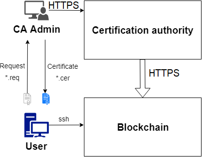

.. _pki-description:

PKI
=======

Инфраструктура публичных ключей (PKI - Public Key Infrastructure) предназначена для безопасного обмена данными между пользователями. В основе инфраструктуры лежат цифровые сертификаты, которые содержат данные пользователя и его открытый ключ, скреплённые электронной подписью удостоверяющего центра. Подробнее про PKI можно почитать на `Wikipedia <https://en.wikipedia.org/wiki/Public_key_infrastructure>`_.

Схема PKI в блокчейн-платформе Waves Enterprise
-------------------------------------------------

          Схема взаимодействия в PKI

Инфраструктура публичных ключей, использующаяся в блокчейне Waves Enterprise, включает в себя следующие базовые компоненты:

* Удостоверяющий центр (Certification Authority) - точка доверия, ответственная за создание и подтверждение сертификатов пользователей.
* Администратор УЦ (CA Administrator) - сотрудник, управляющий службами УЦ и выпускающий сертификаты.
* Пользователь - владелец сертификата, или субъект, запрашивающий сертификат.
* Блокчейн Waves Enterprise.

Удостоверяющим центром может быть как отдельный сервер с установленным ПО `УЦ ПАК «КриптоПро УЦ 2.0» <https://www.cryptopro.ru/products/ca/2.0>`_, так и внешний поставщик сертификатов. Пользователь может взаимодействовать как с администратором УЦ, так и со структурой УЦ напрямую.

Для обмена информацией с УЦ используется защищённый канал TLS с двухсторонней аутентификацией. 

