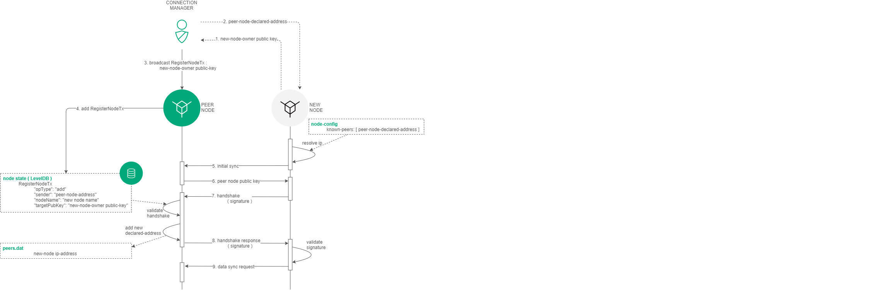

.. _registration-node:

Управление доступом
===========================

Блокчейн-платформа Waves Enterprise реализует закрытую модель блокчейна, в которой подключение новых участников модерируется полномочиями отдельного пользователя. Этот вид блокчейна похож на публичный открытый блокчейн за исключением того, что данные в нем открыты не для всех. Преимуществом данной модели является его повышенная, по сравнению с открытыми блокчейнами, безопасность, а также возможность гибкой настройки уровней доступа и распределения прав.

В блокчейне Waves Enterprise правом на подключение участников к сети обладает пользователь с ролью "Connection Manager". Доказательством возможности подключения к блокчейн сети является отдельная транзакция :ref:`111 RegisterNode <RegisterNodeTransaction>`. В данной транзакции указываются учетные данные подключаемого узла. По результатам добавления подобных транзакций у каждого узла формируется таблица разрешенных участников.

Каждая попытка подключения участника сопровождается :ref:`handshake-сообщением <network-message-auth-handshake>`, в котором помимо служебной информации указывается область данных с доказательством принадлежности к подключаемой сети - в упрощенном виде это совокупность публичного ключа с электронной подписью участника.
Поскольку публичный ключ подключаемого участника уже сохранен в хранилище остальных пиров, то участник получивший handshake-запрос сверяет подпись и предоставленный ранее в блокчейне публичный ключ. Если проверка завершилась успехом, то участник формирует ответный handshake-запрос, при успехе которого устанавливается соединения между сторонами. После успешного подключения участники выполняет синхронизацию с сетью, а так же синхронизацию таблицы соотстветствия блокчейн и сетевых адресов узлов, что необхомо в дальнейшем в процессе пересылки :ref:`конфиденциальных данных <data-privacy>`.

Процесс отключения какого-либо участника от сети аналогичен ранее описанному процессу за тем исключением, того что пользователь с ролью "Connection Manager" выпускает транзакцию :ref:`111 RegisterNode <RegisterNodeTransaction>` с параметром ``"opType": "remove"``. Поскольку, handshake-запрос выполняется с частотой 1 раз в 30 секунд, то следующий, после удаления участника из сети запрос, будет запрещен, ввиду отсутствия учетных данных подключаемого участника в таблице блокчейн-узла.

