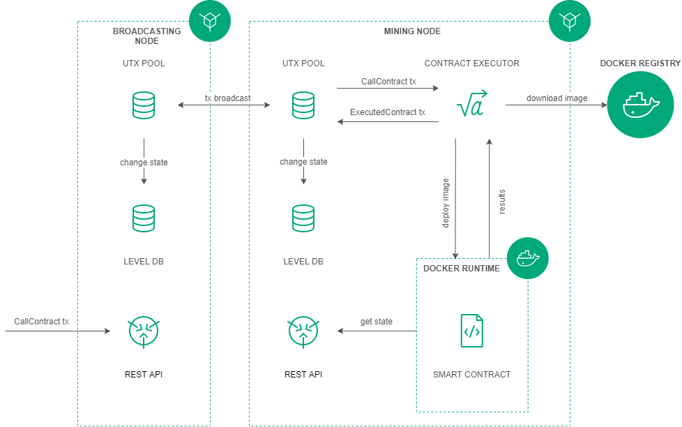

.. _docker:

.. |br| raw:: html

    

Cмарт-контракты Docker
=======================================

.. important:: Функциональность Docker-контрактов доступна начиная с релиза версии 0.8.

В дополнение к контрактам, реализованным на базе :ref:`скриптов RIDE <ride>` для смарт-аккаунтов и смарт-ассетов, платформа Vostok предоставляет возможность разработки 
и использования Тьюринг-полных смарт-контрактов.
Для реализации Тьюринг-полных контрактов выбран подход, в котором программы запускаются в изолированной среде Docker-контейнера. 
При этом разработка приложений может выполняться без ограничений на используемый язык программирования. 
Каждое приложение запускается в Docker-контейнере для возможности изоляции и управления ресурсами, доступными конкретному приложению.  
Для хранения смарт-контрактов используется Docker Registry с доступом на чтение образов (Docker images) контрактов для машин с нодами.
Доступ к состоянию ноды выполняется через REST API ноды. 

Создание контракта
--------------------------

Создание смарт-контракта начинается с подготовки Docker-образа, который состоит из программного кода контракта, необходимого окружения и из специального сценарного файла Dockerfile.
Подготовленный Docker-образ собирается (build) и отправляется в Docker Registry.

Пример Dockerfile: ::

    FROM python:alpine3.8
    ADD contract.py /
    ADD run.sh /
    RUN chmod +x run.sh
    CMD ["/bin/sleep", "6000"]

Установка контракта реализуется через публикацию специальной (CreateContractTransaction) транзакции, содержащей ссылку на образ в Docker Registry. 
После получения транзакции нода скачивает образ по указанной в поле "image" ссылке, образ проверяется и запускается в виде Docker-контейнера.

Исполнение контракта
-----------------------------

Исполнение смарт-контрактов инициируется специальной (CallContractTransaction) транзакцией, в которой содержится идентификатор контракта и параметры для его вызова.
По идентификатору транзакции определяется Docker-контейнер. Контейнер запускается, если не был запущен ранее. В контейнер передаются параметры запуска контракта.
| Смарт-контракты изменяют своё состояние через обновление пар ключ - значение.

Обновление контракта
-----------------------------

Для обновления контракта его измененный код должен быть выложен в Docker Registry и опубликована специальная (UpdateContractTransaction) транзакция. В транзакции указывается ссылка на идентификатор контракта и обновленный Docker image.

Запрет вызова контракта
--------------------------------

При необходимости разработчик контракта может запретить его вызов. Для этого публикуется специальная (DisableContractTransaction) транзакция с указанием идентификатора контракта.

Описание транзакций
------------------------

Для реализации взаимодействия между блокчейном и Docker контрактом реализованы следующие транзакции:

.. csv-table::
   :header: "Код","Тип транзакции", "Назначение"
   :widths: auto

   103, :ref:`CreateContractTransaction <CreateContractTransaction>`,Инициализация контракта. Подписание транзакции производится пользователем с ролью :ref:`"contract_developer" <authorization>`
   104, :ref:`CallContractTransaction <CallContractTransaction>`,Вызов контракта. Подписание транзакции производится инициатором исполнения контракта
   105, :ref:`ExecutedContractTransaction <ExecutedContractTransaction>`,"Запись результата исполнения контракта на стейт контракта. |br|  Подписание транзакции производится нодой, формирующей блок"
   106, :ref:`DisableContractTransaction <ExecutedContractTransaction>`,Запрет вызова контракта. |br|  Подписание транзакции производится пользователем с ролью :ref:`"contract_developer" <authorization>`
   107, :ref:`UpdateContractTransaction <UpdateContractTransaction>`,Обновление кода контракта. |br|  Подписание транзакции производится пользователем с ролью :ref:`"contract_developer" <authorization>`

Конфигурация ноды
-----------------------

Скачивание и исполнение Docker-контрактов, инициированных транзакциями с кодами ``103 - 107`` выполняется на нодах с включенной опцией ``docker-engine.enable = yes`` 
(подробнее в разделе :ref:`"Установка и настройка" > "Запуск Docker-контрактов" <docker-configuration>`).

REST API
--------------

Описание REST API Docker-контрактов приведено в разделе :ref:`"Использование" > "REST API ноды" > "Contracts" <contracts>`.

Примеры реализации
-----------------------------

- :ref:`Создание простого контракта <first-contract-tutorial>`

