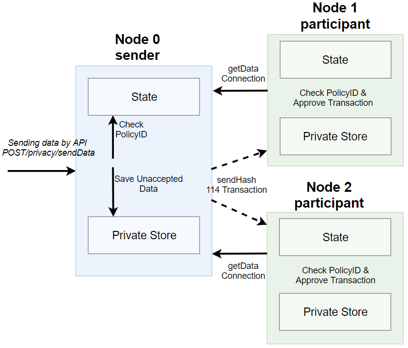

.. _privacy-using:

Добавление в сеть новой ноды
------------------------------

Новые ноды можно добавлять в сеть в любой момент времени. Настройка конфигурационных файлов новой ноды описана 
в подразделе :ref:`Подключение к существующей сети <configuration>`. Далее будут описаны действия, выполняемые при подключении новой ноды в сеть.

1. Пользователь генерирует криптографически связанную пару ключей - публичный и приватный, которые сохраняются в хранилище ключей ноды (keyStore).
2. Администратор сети (нода с ролью "Connection-manager") получает от нового пользователя публичный ключ и описание ноды, далее создаёт транзакцию :ref:`111 RegisterNodeTransaction <RegisterNodeTransaction>` с полученными данными.
3. Транзакция попадает в блок и далее в стейты нод участников сети. Вследствие транзакции среди сохраняемых данных каждый участник сети хранит обязательно публичный ключ и адрес новой ноды.
4. При необходимости администратор сети может добавить новой ноде дополнительные роли при помощи транзакции :ref:`102 PermitTransaction <PermitTransaction>`.
5. Пользователь запускает :ref:`ноду <install-node>`.
6. После запуска нода отправляет handshake-сообщение со своим публичным ключом участникам из списка "peers" своего конфигурационного файла.
7. Участники сети сравнивают публичный ключ из handshake-сообщения и ключ из транзакции 111, отправленной администратором сети. Если проверка успешна, участник сети обновляет свою БД и рассылает в сеть сообщение :ref:`Peers Message <network-message-PeersMessage>`.
8. Успешно подключившись, новая нода выполняет синхронизацию с сетью и получает таблицу адресов участников сети.

.. _data-privacy-exchange:

Процесс обмена конфиденциальными данными
-----------------------------------------

В упрощенном варианте передача конфиденциальных данных между нодами состоит из следующих этапов:

1. Клиент через API отправляет данные в ноду, используя инструмент :ref:`API <privacy-api>` POST /privacy/sendData (параметры API: отправитель, пароль, ID политики, тип данных, инфо о данных, дата и хэш).
2. Нода запрашивает политику, ID которой клиент передал в API, из своего стейта и удостоверяется, что может участвовать в обмене конфиденциальных данных (адрес ноды есть в списке адресов политики).
3. Нода помещает данные в Private Store в статусе Unaccepted, подписывает и рассылает по сети транзакцию 114 :ref:`PolicyDataHashTransaction <PolicyDataHashTransaction>` с хэшом данных.
4. Ноды в сети проверяют, являются ли они участниками политики, и если да, то принимают транзакцию с хэшом данных.
5. После принятия участниками сети и попадания в блокчейн транзакции 114 нода-отправитель изменяет статус данных из своего Private Store с **Unaccepted** на **Accepted**.
6. Далее данные из Private Store ноды-отправителя участники сети запрашивают по прямому соединению, используя эфемерные криптографические пары ключей.

**Схема процесса**

