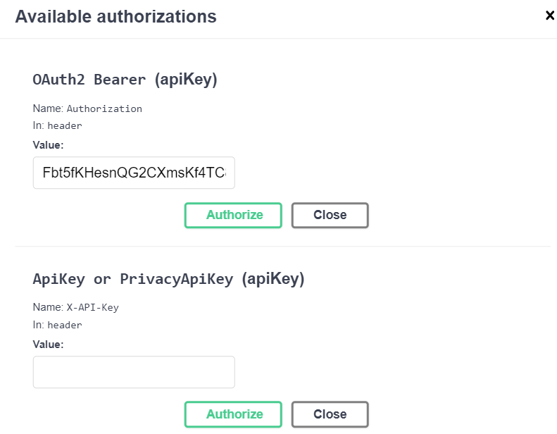

.. _rest-api-common:

REST API
==============

Блокчейн-платформа Waves Enterprise предоставляет возможность взаимодействия с блокчейном как в части получения данных (транзакции, блоки, балансы и др.), так и в части записи информации в блокчейн (подписание и отправка транзакций) при помощи RESTful API ноды. REST API позволяет пользователям удалённо взаимодействовать с нодой через запросы и ответы в формате JSON. Работа с API происходит по протоколу HTTPS. Удобным интерфейсом к API служит известный фреймворк Swagger.

.. toctree::
   :titlesonly:
   :maxdepth: 1

   rest-api-methods
   rest-api-auth-methods
   rest-api-data-service

.. _rest-api-node:

Как использовать REST API
---------------------------

Все вызовы методов API — это GET, POST или DELETE HTTPS-запросы к URL ``https://yournetwork.com/node-N/api-docs/swagger.json`` с набором параметров. В интерфейсе Swagger выбираются нужные группы запросов и далее маршруты с точками доступа. Маршрут в Swagger это URL к HTTP-методу, а точка доступа (endpoint) - конечная часть маршрута, само обращение к методу. Пример:

**URL к HTTP-методу**

.. image:: img/route-endpoint.png
   :align: center

Для запросов, требующих нижеперечисленных действий, необходима обязательная авторизация по ``api-key-hash``. Тип авторизации устанавливается в конфигурационном файле ноды. Если выбран тип авторизации по ``api-key-hash``, то при авторизации необходимо указывать значение секретной фразы, hash которой указан в конфигурационном файле ноды (поле ``rest-api.api-key-hash``).

- доступ к keystore ноды (например, метод sign);
- доступ к операциям с группами доступа к приватным данным;
- доступ к конфигурации ноды.

При авторизации по токену в соответствующем поле указывается значение **access** токена. Если выбрана авторизация по токену, в таком случае закрыты все методы REST API для доступа к ноде.

Методы авторизации
---------------------

В зависимости от метода авторизации указываются разные значения для получения доступа к REST API ноды.

* ``OAuth2 Bearer (apiKey)`` - значение **access** токена.
* ``ApiKey or PrivacyApiKey (apiKey)`` - значение ``api-key-hash`` как для общего доступа к REST API ноды, так и для доступа к методам :ref:`privacy <privacy-api>`.

Авторизация по ``api-key-hash``
~~~~~~~~~~~~~~~~~~~~~~~~~~~~~~~~~~~~~~

Генерация значения ``api-key-hash`` выполняется при :ref:`конфигурации ноды <auth-api-key-setup>`. Также получить значение поля ``rest-api.api-key-hash`` можно при помощи метода :ref:`/utils/hash/secure <utils-hash>` REST API ноды. Для подписания запросов ключем из keystore ноды в поле ``password`` запроса ``POST /transaction/sign`` требуется указания пароля доступа к keystore.

Пример запроса:

.. code::

    curl -X POST 
    --header 'Content-Type: application/json' 
    --header 'Accept: application/json' 
    --header 'X-API-Key: 1' -d '1' 'http://2.testnet-pos.vostoknodes.com:6862/transactions/calculateFee'

Авторизация по токену
~~~~~~~~~~~~~~~~~~~~~~~~~~~~

Если используется :ref:`сервис авторизации <authorization-service>`, для доступа к ноде и другим сервисам клиент получает пару токенов - **refresh** и **access**. Токены можно получить через REST API сервиса авторизации.

